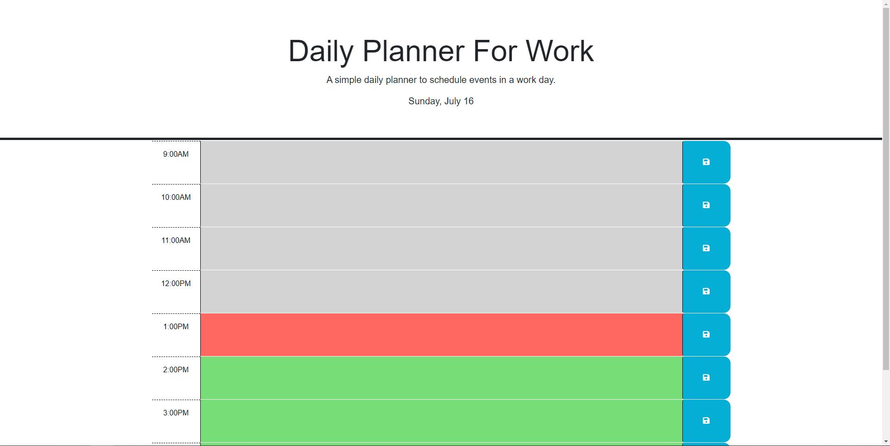

# daily-planner

## Description

The reason behind creating this project was to build a daily planner for work that can schedule tasks throughout the day.

This project was built to help out those who are busy at work who need a quick way to schedule their busy days.

I learned a lot about 'Third-party APIs' during the creation of thisn project. Finding all the different ways to use the different APIs was a challenge at first but it did make creating the website a lot easier than using traditional methods.

## Usage

Below is a description of how to use this website.

Link to deployed webpage:

Features:

1. The current date and day is displayed under the header and short description.

2. Select which time slot you would like to plan for. After writing the work task you have/need to do in the space provided, hit the save button (blue button). Refreshing the page will save your data until it is deleted and saved again.

3. The red zone represents the current hour of the day.

4. The green zone represents future hours of the day.

5. The grey zone represents past hours of the day.